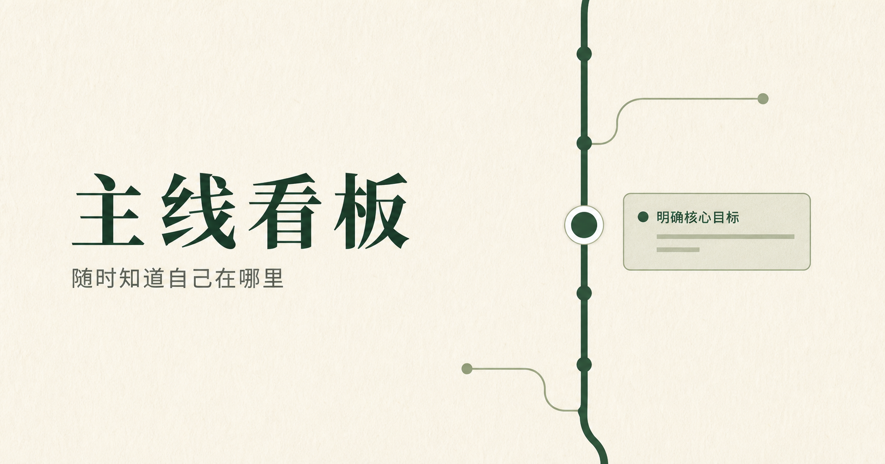

# 主线看板

[打开网站](https://mainline-board-onna.q2354334260.chatgpt.site)

给容易跳到岔路的人用的任务路线图：随时看见自己在哪里、这件事从哪里长出来，以及完成后该回到哪里。



## 怎么用

1. 第一次打开或清空记录后，只需回答“这件事叫什么？”。
2. 在当前任务下点“+ 新任务”，只写这件事叫什么。
3. 点“去处理”进入岔路。当前任务会显示它来自哪一条线。
4. 做完后点“完成并回到…”，回到它的直接来源任务。
5. 已完成的岔路会留在路线树中，带勾选和删除线；未完成的同级岔路仍在下方列表。
6. 点路线节点前的“− / +”可折叠或展开下级任务。

## 其他操作

- 右上角可复制或下载 Markdown，导入思维导图。
- 岔路列表和进入岔路后的当前卡片都有“删除”。确认后，该岔路和所有下级任务一起删除。
- 右上角“清空记录”会删除全部项目和任务，然后回到新任务的一句提问。
- 可新建项目，并从右上角切换项目。

## 数据说明

任务保存在当前浏览器本地。清除浏览器数据、换浏览器或换设备后不会自动保留；Markdown 导出适合备份路线文本。

## 本地开发

```bash
npm install
npm run dev
npm run build
npm test
```
